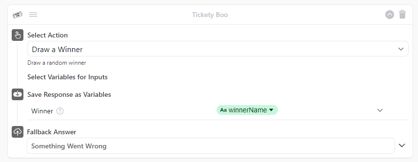
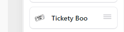

# Tickety Boo Simple App

A not-so-simple Simple App for Tickety-Boo, Ada's Holiday Raffle draw bot, powered by Netlify

Inspired in large part by, and copied from: https://github.com/AdaSupport/simpleapp-okta

## Testing

This is deployed at <https://kix.ada.support/chat> -- just trigger the raffle flow using the phrase `"Tickety Boo"`, and see for yourself how it works. Ping me and I can also give you access to the bot Dashboard.

## Deploying

Fun part! Should you want to deploy your own version of the Netlify Functions elsewhere or deploy Okta to your own bot, follow these steps below.

### Netlify

**Deploying using GitHub Actions**

This is the recommended way. In the project repo on Github, go to [Actions > Workflows > Deploy Netlify Functions](https://github.com/AdaSupport/simpleapp-tickety-boo/actions/workflows/deploy_netlify_function.yml) and click **Run Workflow** on the right.

This will build the current repo and deploy the updated functions on Netlify. The deploy URL is `https://simpleapp-tickety-boo.netlify.app`, and you can invoke the functions at `https://simpleapp-tickety-boo.netlify.app/.netlify/functions/<function_name>`. Easy!

### Simple App

**Deploying using GitHub Actions**

This is the recommended way. In the project repo on Github, go to [Actions > Workflows > Deploy Simple App](https://github.com/AdaSupport/simpleapp-tickety-boo/actions/workflows/deploy_simpleapp.yml) and click **Run Workflow** on the right.

You will be prompted for a bot url and a JWT token, so just fill those in, and you're good to go. In a couple of seconds -- presto! Tickety Boo is now up and running on your bot.

**Deploying manually (ie. if you want customizations)**

First, take note of the Netlify site URL you obtained from deploying above. This repo is set to use `https://simpleapp-tickety-boo.netlify.app`, so if you're not self-deploying the Netlify functions yoruself, just that that.

If you're using a different Netlify URL, make sure to edit `simpleapp/manifest.json`, and update the `uri` of every `action`'s `http_recipe`.

Deploying the Simple App is as easy as making a POST request using Postman/Curl to `https://<your-bot-handle>.ada.support/api/apps-api/apps` with the following parameters:

- Headers:
    - `X-Ada-Simple-App-Auth: <ask for one from chat enrichment team>`
    - `Content-Type: application/json`
- Body: `the contents of simpleapp/manifest.json`

Once that's done, you should be able to see Tickety Boo app in the right drawer on your bot dashboard.

